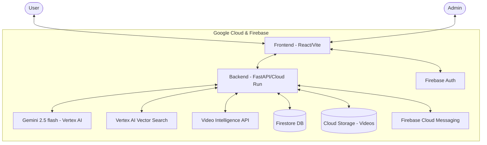

# 🗳️ ElectAssist — Election Intelligence Platform

**Empowering Citizens with AI-Driven Election Insights**

ElectAssist is an interactive, AI-powered election assistant designed to help citizens navigate the complexities of the election process. By leveraging Google's advanced AI and cloud services, the platform provides real-time information about candidates, verifies community-contributed proofs of work, and ensures citizens stay informed about upcoming elections in their locality.

---

## 🎯 Chosen Vertical
**Smart Citizen & Election Assistant**
This project falls under the domain of civic technology and election transparency. It aims to bridge the information gap between voters and candidates by providing an AI-driven, accessible, and verified source of truth for local elections.

---

## 🧠 Approach and Logic
Our approach centers around trust, accessibility, and AI-driven insights:
1. **Trust through Verification:** We leverage community-sourced video proofs of candidate works. To prevent misinformation, these videos are subjected to AI-assisted moderation (using Video Intelligence) before being approved by administrators, directly impacting a candidate's "Trust Score".
2. **Accessible Information:** Complex election manifestos and procedures are simplified using a RAG (Retrieval-Augmented Generation) chatbot powered by Gemini 2.5 Flash. This allows voters to ask natural language questions in multiple languages.
3. **Locality-Awareness:** Voters care most about their immediate surroundings. We integrate Google Maps to visualize polling booths, verified work locations, and candidate activities specific to a voter's ward.
4. **Security & Accessibility First:** We prioritize WCAG compliance for the frontend to ensure all citizens can use the platform, and robust Firebase/FastAPI security for the backend to protect user data.

---

## ⚙️ How the Solution Works
1. **User Authentication:** Citizens and admins log in securely using Firebase Auth (Google OAuth).
2. **Exploration & Discovery:** Users can view the Candidate Leaderboard, sorted by Trust Scores, or use the interactive Map to find local polling booths.
3. **AI Chatbot (RAG):** Users interact with the ElectAssist Guide. The backend processes the query, retrieves relevant local election data or candidate manifestos using Vertex AI Vector Search, and generates a grounded response using Gemini 2.5 Flash.
4. **Community Contributions:** Citizens can upload video proofs of a candidate's completed public works.
5. **Moderation Queue:** Uploaded videos enter a pending state. Admins review them via a secure dashboard. Approved videos automatically increment the candidate's verified works and Trust Score in Firestore.

---

## 🤔 Assumptions Made
- **Data Availability:** It is assumed that an initial seed of candidate data (names, parties, wards) and official manifestos are available to populate the Firestore database and Vector Search index.
- **Admin Provisioning:** The first admin user is manually provisioned or verified out-of-band to establish the root of trust for the moderation system.
- **Modern Browser:** The frontend assumes the user is on a modern browser that supports standard HTML5 video, geolocation, and ES6 JavaScript.
- **Language Support:** While Gemini supports multiple languages, the initial UI text is provided in English, with AI responses handling translation dynamically based on user prompts.

---

## 🏗️ System Architecture



## 🌟 Key Features

- **🤖 AI Chatbot (RAG Agent):** Powered by **Gemini 2.5 flash**, providing grounded answers about candidates and election processes using semantic search over verified data.
- **🏆 Candidate Leaderboard:** A dynamic ranking system based on community endorsements, verified video proofs, and official work records.
- **📹 Community Video Proofs:** Citizens can upload short videos of candidate work, automatically moderated and summarized by the **Video Intelligence API**.
- **🗺️ Locality-Based Map:** Visualize candidates, polling booths, and election zones in your area using **Google Maps**.
- **🔔 Smart Notifications:** Stay updated with **Firebase Cloud Messaging** alerts for election dates and leaderboard changes.
- **🔐 Admin Dashboard:** Secure management of candidate profiles and moderation of community-contributed content.

---

## 🛠️ Technology Stack

| Component | Technology |
|---|---|
| **Frontend** | React, Vite, Vanilla CSS, Lucide Icons |
| **Backend** | FastAPI (Python), Uvicorn |
| **Database** | Firebase Firestore |
| **Authentication** | Firebase Auth (Google OAuth / Phone OTP) |
| **AI / ML** | Gemini 2.5 flash, Vertex AI Vector Search, Video Intelligence API |
| **Infrastructure** | Google Cloud Run, Firebase Hosting, Cloud Storage |
| **Integrations** | Google Maps Embed API, Custom Search API |

---

## 📁 Project Structure

```text
elect/
├── frontend/           # React + Vite (Web Interface)
│   ├── src/
│   │   ├── components/ # Reusable UI components
│   │   ├── pages/      # Main application views
│   │   └── lib/        # Firebase & API configurations
├── backend/            # FastAPI (Cloud Run API)
│   ├── routers/        # API endpoints
│   ├── services/       # Business logic & AI integrations
│   └── schemas/        # Pydantic models
└── infra/              # Security rules & infrastructure config
```

---

## 🚀 Getting Started

### Prerequisites
- Node.js (v18+)
- Python 3.9+
- Google Cloud Project with Vertex AI enabled
- Firebase Project

### Frontend Setup
1. Navigate to the frontend directory:
   ```bash
   cd frontend
   ```
2. Install dependencies:
   ```bash
   npm install
   ```
3. Configure environment variables in `.env`:
   ```env
   VITE_FIREBASE_API_KEY=your_api_key
   VITE_FIREBASE_AUTH_DOMAIN=your_project.firebaseapp.com
   VITE_FIREBASE_PROJECT_ID=your_project_id
   VITE_FIREBASE_STORAGE_BUCKET=your_project.appspot.com
   VITE_FIREBASE_MESSAGING_SENDER_ID=your_sender_id
   VITE_FIREBASE_APP_ID=your_app_id
   ```
4. Run the development server:
   ```bash
   npm run dev
   ```

### Backend Setup
1. Navigate to the backend directory:
   ```bash
   cd backend
   ```
2. Create and activate a virtual environment:
   ```bash
   python -m venv venv
   source venv/bin/activate  # On Windows: venv\Scripts\activate
   ```
3. Install dependencies:
   ```bash
   pip install -r requirements.txt
   ```
4. Configure environment variables in `.env`:
   ```env
   GOOGLE_CLOUD_PROJECT=your_project_id
   GOOGLE_APPLICATION_CREDENTIALS=path/to/your/service-account.json
   ```
5. Run the API:
   ```bash
   uvicorn main:app --reload
   ```

---

## 🛡️ Security
- **Firebase Auth** ensures secure user identity.
- **Firestore Security Rules** protect data from unauthorized access.
- **Admin RBAC** restricts sensitive operations to authorized personnel.

---
